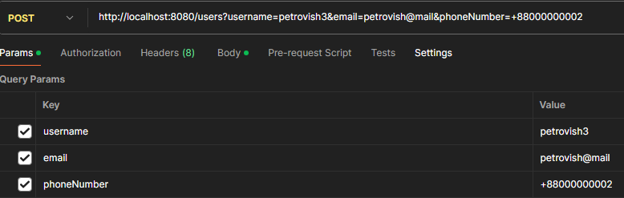

# Система Управления Пользователями

## Функции
- **Добавление пользователя**
- **Получение пользователя по ID**
- **Получение всех пользователя**
- **Удалить пользователя по ID**

## Используемые технологии
- **Java 21 , Gradle 8.5 , Jackson**

### Установка
   git clone https://github.com/posteq/servlet-homework.git

   ./gradlew clean war

### API команды
- GET /users : Получить списка всех пользователей.
- GET /users?id={id}: Получить конкретного пользователя по ID.
- POST /users?username={username}&email={email}&phoneNumber={phoneNumber}: Создать нового пользователя.
- DELETE /users?id={id}: Удалить пользователя по ID.

### Пример запроса

